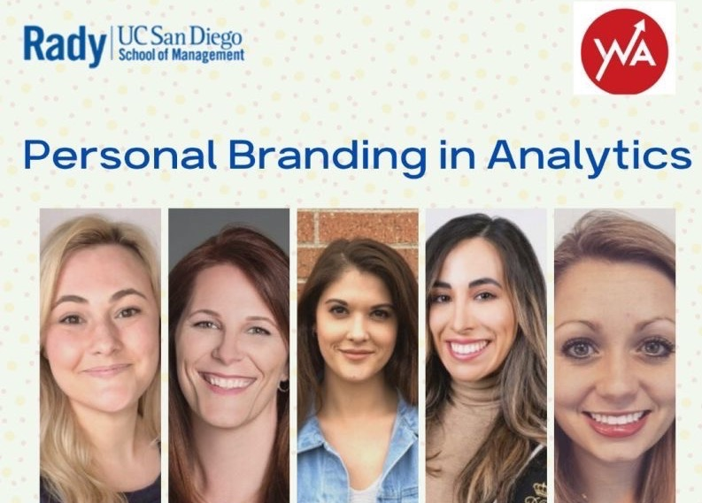
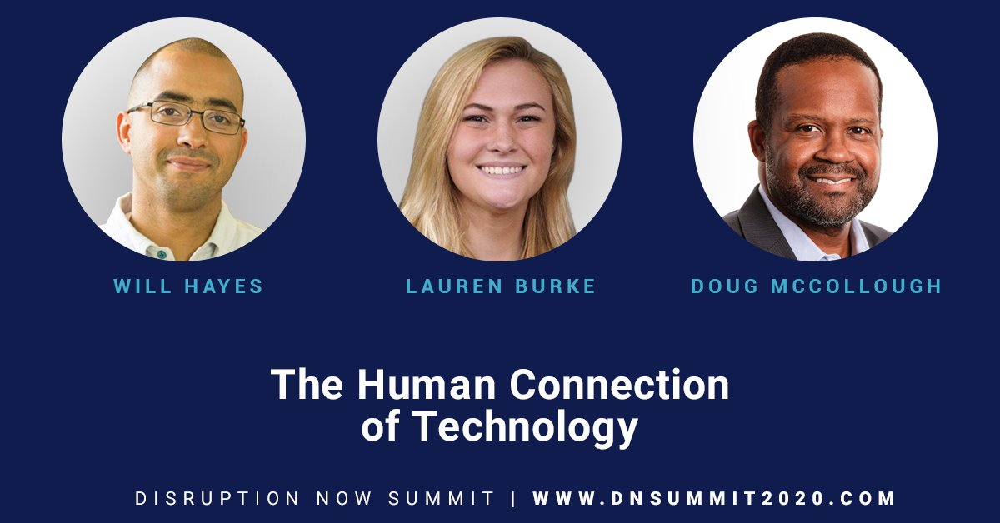
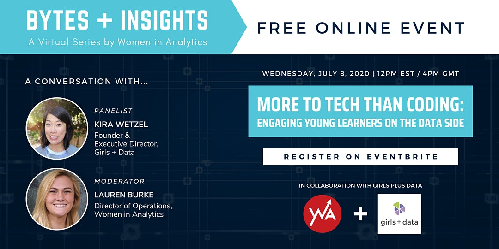

<h4 style="font-size:20px;">
  Hi, I'm Lauren Burke. As a Data Scientist, I find creative solutions to complex problems.
</h4>

Currently in the healthcare industry, I recently transitioned into product after spending some time implementing forecasting solutions to support new and renewal business opportunities. Previously, I was in the retail space and developed solutions across several areas including supply chain, inventory management, and enterprise business. 

Outside of work, I'm an active member of my local and larger tech communities. 
As the Director of Operations of Women in Analytics, a global community that promotes visibility to women making an impact in the analytics space, my primary focuses lie in marketing, strategy, and community growth. I've has launched multiple initiatives including the Ambassador Program, Women to Watch, and merchandise while expanding numerous others.

<h4 style="font-size:20px;">
Community Involvement
</h4>

[TECH CORPS](https://techcorps.org/)

<h4 style="font-size:20px;">
Speaking
</h4>

Here's a couple of...

<h4 style="font-size:20px;">
   
Let's Connect!
</h4>

Get in touch via email or any of the social media channels linked below.

