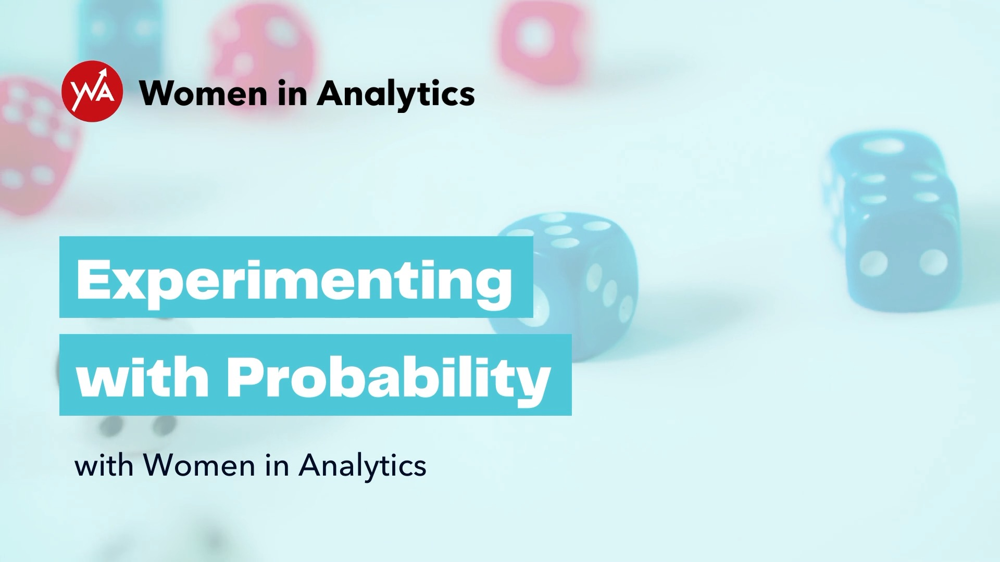

<h3 style="font-size:25px;">
  Hi, I'm Lauren Burke. As a Data Scientist, I find creative solutions to complex problems.
</h3>

 

Currently in the healthcare industry, I recently transitioned into product after spending some time implementing forecasting solutions to support new and renewal business opportunities. Previously, I was in the retail space and developed solutions across several areas including supply chain, inventory management, and enterprise business. 

Outside of work, I'm an active member of my local and larger tech communities. As the Director of Operations of <a href="https://womeninanalytics.com" target="_blank" style="text-decoration: none; color:#039fb9">Women in Analytics</a>, a global community that promotes visibility to women making an impact in the analytics space, my primary focuses lie in marketing, strategy, and community growth. Since joining the team, we have launched multiple initiatives including the Ambassador Program, Women to Watch, Membership, and merchandise while expanding numerous others.

<h4 style="font-size:20px;">
Community Involvement
</h4>

 I'm an avid supporter of initiatives that foster enthusiasm for STEM and encourage the development of creative problem-solving skills. Here are a few of the organizations that I am currently or have previously been involved with over the years. 

  

  <ul style="font-size:16px;">
    <li style="font-size:16px;"><a href="http://techcorps.org/" target="_blank" style="text-decoration: none; color:#039fb9">TECH CORPS</a>: A national nonprofit headquartered in Columbus. I have been involved for a number of years as a volunteer, Career Corps speaker, and hackathon judge/mentor. In 2021, I was invited to join the Regional Steering Committee.</li>
    <li style="font-size:16px;"><a href="https://stemifygirls.org/" target="_blank" style="text-decoration: none; color:#039fb9">STEMifyGirls</a>: I serve on the Board of Directors of STEMifyGirls, a nonprofit organization that empowers girls and young women to explore and develop an interest in STEM through early exposure and inspiration.</li>
    <li style="font-size:16px;"><a href="https://cosi.org/" target="_blank" style="text-decoration: none; color:#039fb9">COSI</a>: For the past two years, Columbus' Center of Science & Industry has been voted the Best Science Museum in the nation. Since May 2018, I have served on the Kinetic Emerging Leaders Board and in 2020 was elected as Vice Chair.</li>
    <li style="font-size:16px;"><a href="http://education.ohio.gov/Topics/Learning-in-Ohio/Mathematics/Resources-for-Mathematics/Math-Pathways/Data-Science-Foundations" target="_blank" style="text-decoration: none; color:#039fb9">Ohio Dept of Education, Data Science Foundations Work Group</a>: The ODOE Department of Education partnered with the Ohio Department of Higher Education and Ohio Math Initiative to develop courses that satisfy the credit requirement for Algebra 2. I served as an Industry Advisor to this workgroup.</li>
    <li style="font-size:16px;"><a href="https://dataforsocialgood.weebly.com/" target="_blank" style="text-decoration: none; color:#039fb9">Data Science for Social Good</a>: I have served as a mentor for Data Science for Social Good, a free 6 week program that empowers future computer scientists and social entrepreneurs with the skills to leverage data science and its versatile tools to understand real-life problems and develop data-driven solutions to societal challenges.</li>
    <li style="font-size:16px;"><a href="https://www.builtbygirls.com/about-wave" target="_blank" style="text-decoration: none; color:#039fb9">Built By Girls</a>: I have served as an Advisor for a few sessions of WAVE, a one-of-a-kind mentorship program that is designed to support students as they take the first step into their careers.</li>
  </ul>

<h4 style="font-size:20px;">
Speaking
</h4>

<table style="width:100%; border:none;" cellspacing="10" >
  <tr style="border:none;">
    <td style="border: none;font-size:16px;">Personal Branding in Analytics Panel discussion with UC San Diego Rady School of Management's Analytics Program around networking effectively and positioning yourself for success in your analytics career.</td>
    <td style="width:30%;border:none;font-size:16px;"></td>
  </tr>
  
  <tr style="border:none;">
     <td style="border: none;font-size:16px;">The Human Connection of Technology   Panel discussion at 2020 Disruption Now Summit. This session focuses on the ethics of implementing AI solutions and new algorithms and their resulting risks and impact on communities.</td>
    <td style="width:30%;border:none;font-size:16px;"></td>
   </tr>
  
  <tr style="border:none;">
    <td style="border: none;font-size:16px;">More to Tech than Coding: Engaging Young Learners on the Data Side  Part of the Bytes & Insights webinar series. This discussion focuses on the importance of introducing and engaging young learners around the many career paths in data.</td>
    <td style="width:30%;border:none;font-size:16px;"></td>
  </tr>
  
  <tr style="border:none;">
    <td style="border:none;font-size:16px;">Experimenting with Probability  Hands-on activity involving probability developed as part of the 2021 COSI Science Festival.</td>
    <td style="width:30%;border:none;font-size:16px;"></td>
  </tr>
  
  <tr style="border:none;">
    <td style="border:none;font-size:16px;">Elevate Your Data Exploration  Partner event panel with AWS, Slalom, Women in Big Data, and WIA.</td>
    <td style="width:30%;border:none;font-size:16px;"></td>
  </tr>
  
  <tr style="border:none;">
    <td style="border:none;font-size:16px;">Girls Who Lead Summit An interactive talk surrounding statistics, probability, and data visualization at the PAST Foundation's 2019 Girls Who Lead Summit.</td>
    <td style="width:30%;border:none;font-size:16px;"></td>
  </tr>
</table>

 

<h4 style="font-size:20px;">
Let's Connect!
</h4>

  Get in touch via <a href="mailto:laurenemilyburke17@gmail.com" style="text-decoration: none; color:#039fb9">email</a> or any of the social media channels linked below.

